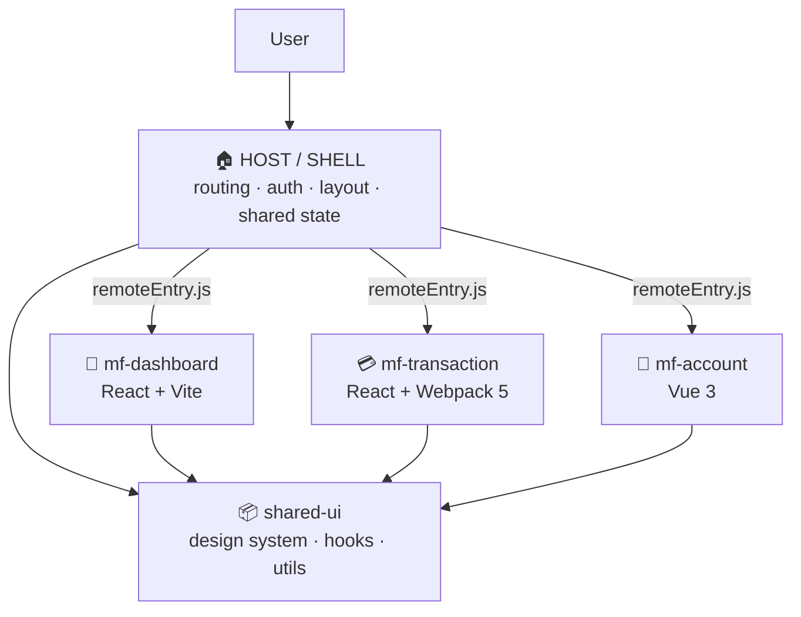

<div align="center">

<a href="https://port-tau-azure.vercel.app">
  
</a>

<br/>

<a href="https://port-tau-azure.vercel.app">
  
</a>
<a href="https://www.linkedin.com/in/angga-w-a45b0111a/">
  
</a>
<a href="mailto:anggawika18@gmail.com">
  
</a>


</div>

---

## 🧭 About Me

> Software Engineer with **5+ years** of experience building scalable web and mobile applications.

- 🏗️ I build **frontend and fullstack** products — from pixel-accurate UI to the API and database behind it.
- ⚛️ Web with **React.js, Next.js, Vue.js**; mobile with **React Native** and **Flutter**.
- 🧩 I design **Micro Frontend** architectures — splitting a large app into independently built and deployed modules with **Module Federation**.
- 🛠️ Backend with **Node.js** and **Laravel**, backed by **MySQL** and **MongoDB** (Mongoose ODM, Eloquent ORM).
- ✨ I care about **clean, maintainable, scalable, and accessible** code.
- 🤝 Comfortable collaborating with cross-functional teams in **Agile Scrum** environments.
- 🌐 More projects and technical details → **[port-tau-azure.vercel.app](https://port-tau-azure.vercel.app)**

---

## 🧩 Micro Frontend Architecture

Instead of one giant SPA, I split the frontend into **independent modules** — each with its own repo/workspace, its own build, its own deploy, and its own team ownership. A thin **Host (Shell)** composes them at runtime.



### How the modules are split

| Module | Type | Responsibility |
| :--- | :--- | :--- |
| **Host / Shell** | Container | App routing, authentication, global layout, error boundary, loading remotes |
| **Feature Remotes** | Remote | One business domain per module (dashboard, transaction, account) — built & deployed on its own |
| **shared-ui** | Library | Design system components, theme tokens, shared hooks & helpers |
| **shared-core** | Library | API client, auth session, event bus, TypeScript contracts |

### Key principles

- **Independent deploy** — a remote ships without rebuilding the host or any sibling module.
- **Shared singletons** — `react`, `react-dom`, and the router are declared as `singleton: true` so only one instance lives in the browser.
- **Contract-first** — every remote exposes a typed public surface; nothing reaches into another module's internals.
- **Runtime isolation** — a failing remote is caught by the shell's error boundary instead of taking down the whole app.
- **Graceful fallback** — lazy loading with `<Suspense>` + skeleton while `remoteEntry.js` is fetched.

### 🛠️ Tools I use

| Layer | Tools |
| :--- | :--- |
| **Composition** | Webpack 5 Module Federation · `@originjs/vite-plugin-federation` · Next.js Multi Zones · single-spa |
| **Monorepo** | Nx · Turborepo · pnpm workspaces |
| **Shared UI** | Storybook · Tailwind CSS · Radix UI · design tokens |
| **Cross-module state** | Zustand · Redux Toolkit · Custom Event Bus (`CustomEvent` / pub-sub) |
| **Contracts & quality** | TypeScript · ESLint · Prettier · Vitest / Jest · Playwright |
| **Delivery** | Docker · GitHub Actions · Vercel — one pipeline per remote |

<details>
<summary><b>📄 Example — Module Federation config</b></summary>

```js
// host/webpack.config.js
new ModuleFederationPlugin({
  name: 'host',
  remotes: {
    dashboard: 'dashboard@https://dashboard.example.com/remoteEntry.js',
    transaction: 'transaction@https://transaction.example.com/remoteEntry.js',
  },
  shared: {
    react: { singleton: true, requiredVersion: '^18.0.0' },
    'react-dom': { singleton: true, requiredVersion: '^18.0.0' },
  },
});

// remote/webpack.config.js
new ModuleFederationPlugin({
  name: 'dashboard',
  filename: 'remoteEntry.js',
  exposes: { './DashboardApp': './src/App' },
  shared: { react: { singleton: true }, 'react-dom': { singleton: true } },
});
```

</details>

---

## 🧰 Tech Stack

<div align="center">

**Languages**


**Frontend & Mobile**


**Architecture & Build**


**Backend & Database**


**Tools & Platform**


</div>

---

## 🚀 Featured Work

| Project | Description | Stack |
| :--- | :--- | :--- |
| **[Personal Portfolio](https://port-tau-azure.vercel.app)** | Fullstack portfolio with public site + protected admin dashboard, drag-to-reorder content, image uploads, and a language lab. | `Next.js 15` `MySQL` `JWT` `Cloudinary` |
| **Project Two** | Short one-line description of what it does and why it matters. | `React Native` `Node.js` `MongoDB` |
| **Project Three** | Short one-line description of what it does and why it matters. | `Vue.js` `Laravel` `MySQL` |

<div align="center">
  <a href="https://port-tau-azure.vercel.app">
    
  </a>
</div>

---

## 🤝 Let's Build Something

<div align="center">

Open to interesting frontend & fullstack work — feel free to reach out.

<a href="mailto:anggawika18@gmail.com">
  
</a>
<a href="https://www.linkedin.com/in/angga-w-a45b0111a/">
  
</a>
<a href="https://github.com/AnggaWikaNugraha">
  
</a>


</div>
